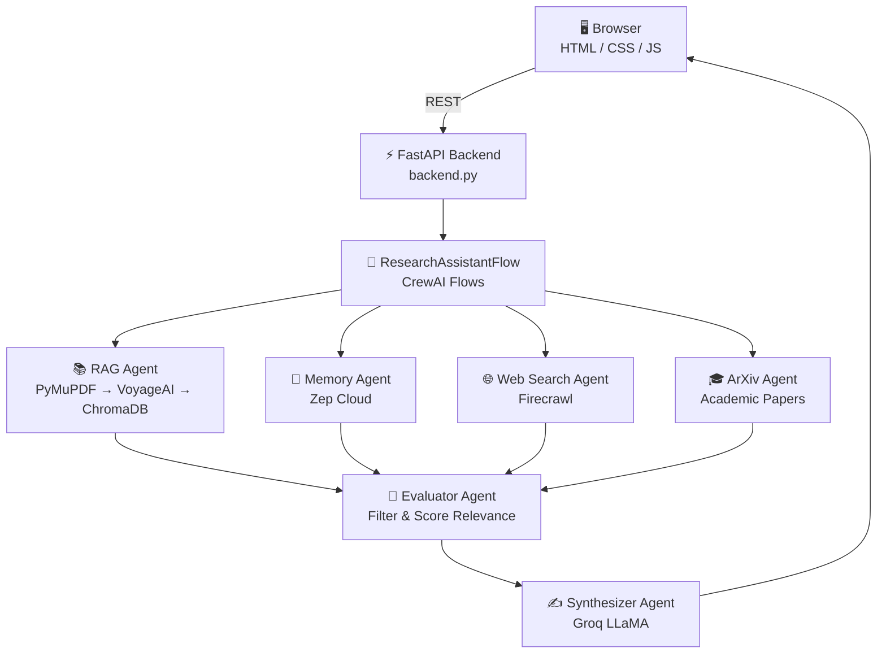

# 🔬 RAG-Powered Multi-Agent Research Assistant

> A production-grade, multi-agent AI Research Assistant powered by **CrewAI Flows**, a **FastAPI** backend, and a premium **HTML/CSS frontend**. It simultaneously queries your documents, persistent memory, real-time web, and academic papers to synthesize a single coherent, cited response.

[](https://github.com/rashedulalbab253/Rag-powered-multiagent-RA/actions/workflows/docker-publish.yml)


---

## ✨ What's New (v2 — FastAPI Migration)

| Before | After |
|---|---|
| Streamlit UI | **Premium HTML/CSS + FastAPI** |
| `milvus-lite` (Linux/macOS only) | **ChromaDB** (cross-platform ✅) |
| `tensorlake` (requires Rust build) | **PyMuPDF** (pre-built wheel ✅) |
| Manual startup | **CI/CD → Docker Hub** via GitHub Actions |

---

## 🏗️ Architecture



---

## 📁 Project Structure

```
context-engineering-workflow/
├── 🐍 backend.py                    # FastAPI app — all API endpoints
├── 📁 frontend/
│   ├── index.html                   # Premium SPA with glassmorphism UI
│   └── style.css                    # Dark theme, animations, responsive
├── 📁 src/
│   ├── 📁 workflows/
│   │   ├── flow.py                  # Main ResearchAssistantFlow (CrewAI)
│   │   ├── agents.py                # Agent factories
│   │   └── tasks.py                 # Task factories
│   ├── 📁 rag/
│   │   ├── rag_pipeline.py          # Unified RAG orchestration
│   │   ├── retriever.py             # ChromaDB vector store
│   │   └── embeddings.py            # VoyageAI contextualized embeddings
│   ├── 📁 document_processing/
│   │   └── doc_parser.py            # PyMuPDF PDF parser (replaces TensorLake)
│   ├── 📁 memory/
│   │   └── memory.py                # Zep Cloud memory layer
│   └── 📁 generation/
│       └── generation.py            # Groq LLaMA structured response gen
├── 📁 config/
│   ├── agents/research_agents.yaml  # Agent personas & goals
│   └── tasks/research_tasks.yaml    # Task descriptions
├── 📄 Dockerfile                    # Multi-stage production image
├── 📄 .dockerignore
├── 📄 .github/workflows/
│   └── docker-publish.yml           # CI/CD: build & push to Docker Hub
├── 📄 pyproject.toml
└── 📄 .env.example
```

---

## 🚀 Quick Start

### Option 1 — Docker (Recommended)

```bash
# 1. Create your .env file
cp .env.example .env
# Fill in your API keys

# 2. Run from Docker Hub
docker run -p 8000:8000 --env-file .env \
  rashedulalbab1234/rag-research-assistant:latest

# 3. Open browser
open http://localhost:8000
```

### Option 2 — Local (Python 3.12+ + pip)

```bash
# 1. Clone & setup
git clone https://github.com/rashedulalbab253/Rag-powered-multiagent-RA.git
cd Rag-powered-multiagent-RA

# 2. Create virtual environment
python -m venv .venv
.venv\Scripts\activate      # Windows
# source .venv/bin/activate  # macOS/Linux

# 3. Install dependencies
pip install -r requirements.txt

# 4. Configure environment
cp .env.example .env
# Edit .env with your API keys

# 5. Start the server
python backend.py
# Or using uvicorn:
# uvicorn backend:app --host 0.0.0.0 --port 8000 --reload

# Open http://localhost:8000
```

### Option 3 — Local (uv package manager)

```bash
# 1. Clone & setup
git clone https://github.com/rashedulalbab253/Rag-powered-multiagent-RA.git
cd Rag-powered-multiagent-RA

# 2. Sync dependencies (reads pyproject.toml & uv.lock)
uv sync

# 3. Configure environment
cp .env.example .env
# Edit .env with your API keys

# 4. Start the server
uv run backend.py
```

---

## 🔑 Environment Variables

Copy `.env.example` to `.env` and fill in your keys:

```env
GROQ_API_KEY=gsk_...           # https://console.groq.com
VOYAGE_API_KEY=pa-...          # https://dashboard.voyageai.com
ZEP_API_KEY=z_...              # https://www.getzep.com
FIRECRAWL_API_KEY=fc-...       # https://www.firecrawl.dev
TENSORLAKE_API_KEY=tl_...      # https://tensorlake.ai  (optional, replaced by PyMuPDF locally)

# Set to "true" to use simulated responses (no API keys needed)
DEMO_MODE=false
```

---

## 📖 Usage Workflow

To get the best results from the Multi-Agent Research Assistant, follow this workflow:

1.  **Initialize**: On the frontend, click the "Initialize" status indicator. This loads the models and connects to services.
2.  **Upload PDF**: Use the upload area to provide your source document. It will be parsed and stored in ChromaDB.
3.  **Research**: Enter your query in the chat box. The agents will coordinate to search the PDF, web, arXiv, and memory to provide a cited response.
4.  **View Sources**: Click the "View Sources" bubble in the response to see exactly where the information came from.

---

## 🛠️ API & Development

### API Documentation
The FastAPI backend provides interactive documentation:
- **Swagger UI**: [http://localhost:8000/docs](http://localhost:8000/docs)
- **ReDoc**: [http://localhost:8000/redoc](http://localhost:8000/redoc)

### Troubleshooting
- **Port 8000 busy**: Change the port in `backend.py` or use `-p 8080:8000` in Docker.
- **Initialization Error**: Ensure your `.env` keys are correct and you've run `pip install -r requirements.txt`.
- **Zep Connection**: If using Zep Cloud, ensure your `ZEP_API_KEY` is active.
- **Demo Mode**: If you lack API keys, set `DEMO_MODE=true` in `.env` to test the UI with mock data.

---

## 🎯 Key Features

### 1. 🤖 6-Agent Research Pipeline
| Agent | Role |
|---|---|
| **RAG Agent** | Searches your uploaded PDFs via semantic similarity |
| **Memory Agent** | Retrieves past conversation context from Zep Cloud |
| **Web Search Agent** | Finds real-time web information via Firecrawl |
| **ArXiv Agent** | Queries academic papers from arXiv |
| **Evaluator Agent** | Scores and filters source relevance (0–1) |
| **Synthesizer Agent** | Generates the final cited response via Groq |

### 2. 📚 Smart RAG Pipeline
- **PDF Parsing**: PyMuPDF with sentence-boundary chunking
- **Embeddings**: VoyageAI `voyage-context-3` (1024-dim)
- **Vector Store**: ChromaDB (persistent, HNSW cosine similarity)
- **Generation**: Groq LLaMA with structured JSON output

### 3. 🧠 Persistent Memory
- Conversation history stored in **Zep Cloud**
- User preferences maintained across sessions
- Automatic summarization to prevent context overflow

### 4. ✨ Premium UI
- Glassmorphism dark theme with cosmic drift animation
- Slide-in chat bubbles with smooth scrolling
- Real-time status indicators for all API services
- Expandable **View Sources & Citations** panel

### 5. 🐳 Production-Ready
- Multi-stage Dockerfile (slim runtime image)
- GitHub Actions CI/CD → Docker Hub on every push
- Health-check endpoint at `/api/status`
- Non-root container user for security

---

## 🌐 API Endpoints

| Method | Endpoint | Description |
|---|---|---|
| `GET` | `/` | Serves the frontend SPA |
| `GET` | `/api/status` | Returns initialization & API key status |
| `POST` | `/api/initialize` | Initializes the multi-agent pipeline |
| `POST` | `/api/upload` | Uploads and processes a PDF into ChromaDB |
| `POST` | `/api/query` | Sends a query through the full agent pipeline |
| `GET` | `/api/history` | Returns the full chat history |
| `POST` | `/api/reset` | Clears the chat history |

---

## 🐳 Docker & CI/CD

The GitHub Actions workflow (`.github/workflows/docker-publish.yml`) automatically:
1. Triggers on every push to `main`
2. Builds with **Docker Buildx** + GHA layer caching
3. Pushes two tags to Docker Hub:
   - `rashedulalbab1234/rag-research-assistant:latest`
   - `rashedulalbab1234/rag-research-assistant:sha-<commit>`

**Required GitHub Secrets:**

| Secret | Value |
|---|---|
| `DOCKERHUB_USERNAME` | `rashedulalbab1234` |
| `DOCKERHUB_TOKEN` | Your Docker Hub Access Token |

---

## 🤝 Contributing

Contributions are welcome! Please fork the repository and submit a pull request.

1. Fork the repo
2. Create your feature branch: `git checkout -b feature/amazing-feature`
3. Commit your changes: `git commit -m 'feat: add amazing feature'`
4. Push to the branch: `git push origin feature/amazing-feature`
5. Open a Pull Request

---

## 📄 License

This project is licensed under the MIT License.

---

<div align="center">
  <sub>Built with ❤️ using CrewAI, FastAPI, ChromaDB, VoyageAI, Zep, and Groq</sub>
</div>
